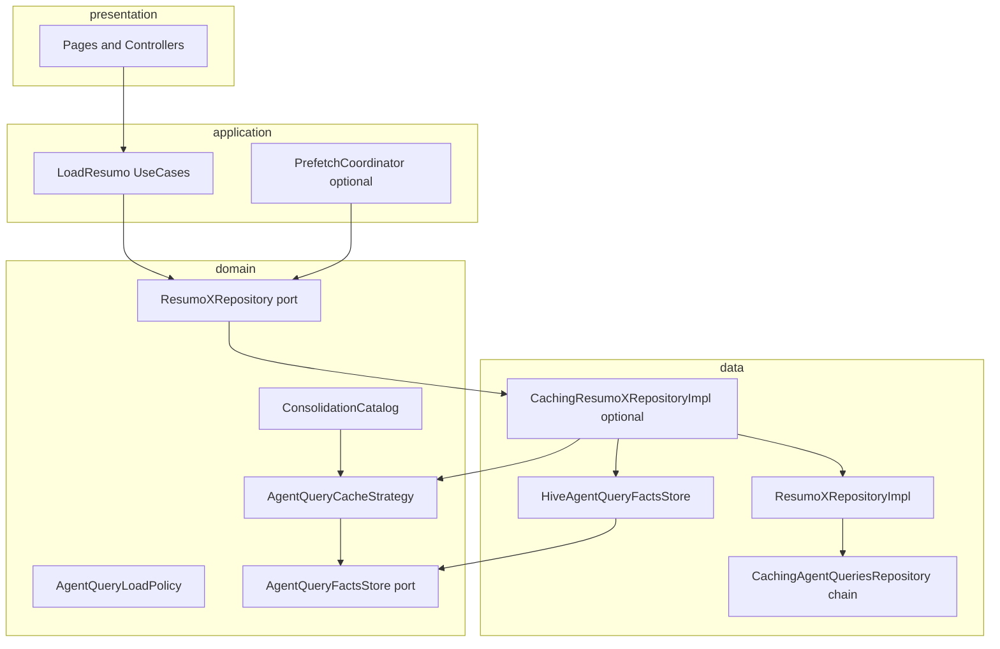

# Architecture — per-repository facts cache

## Problem

The overview home loads many agent SQL reports per filter change. Today:

1. **Transport cache** (`CachingAgentQueriesRepository`) dedupes identical SQL for ~3 seconds only.
2. **Facts store** (`HiveAgentQueryFactsStore`) persists closed day/month buckets per user, agent, and fact kind.
3. **`OverviewBatchLoader`** still batches non-migrated sections via SQL; daily and monthly sections load through cached repository ports when use cases are wired.

Business data for past calendar days/months is stable after ERP close. We want durable, filter-friendly facts without duplicating the same metrics under multiple cache shapes.

## Layering



### Dependency rules

| Layer | May depend on | Must not |
| ----- | ------------- | -------- |
| `domain` | Other domain types | Flutter, Hive, Dio, SQL strings |
| `application` | `domain` | Concrete `Caching*` types |
| `data` | `domain`, `core` | `presentation` |
| `overview` | `agent_queries` ports, own assembler | Own fact storage keys |

## Opt-in via DI (Option A)

Every report keeps a **network** implementation (`*RepositoryImpl`). Caching is enabled only when `injector_agent_queries.dart` registers a **decorator** as the port implementation:

```dart
// No business cache
repo: () => CadastroFilialRepositoryImpl(getIt()),

// With business cache
repo: () => CachingResumoTotalDiarioVendasRepositoryImpl(
  delegate: ResumoTotalDiarioVendasRepositoryImpl(getIt()),
  factsStore: getIt(),
  strategy: getIt(),
),
```

Use cases always depend on `ResumoXRepository`; they do not branch on decorator vs impl.

## Components

### `AgentQueryCacheStrategy<Filter, Row>`

Per-report policy in `data/cache/strategies/`:

- Maps a range `Filter` to a list of **bucket ids** (day string, month key, …).
- Declares which buckets are **closed** relative to `clock`.
- Builds a **per-bucket** `Filter` for the delegate SQL call.
- Serializes/deserializes rows for the facts store.
- Exposes `factKind` and `AgentQueryKey` for the consolidation catalog.

### `AgentQueryFactsStore`

Single persistence port (Hive via `AppCacheStore`):

- `read` / `write` / `remove` by canonical storage key.
- Rejects `write` when catalog marks strategy as `derivedOnly`.
- Rejects duplicate writers for the same `FactKind` + bucket (replication control).

Canonical key shape (logical):

```text
{agentQueryFactsPrefix}{userId}:{agentId}:{factKind}:{bucketId}
```

Prefix constant: `AppKvCacheKeyPrefixes.agentQueryFacts`.

### `BaseCachedAgentQueryRepository`

Shared decorator logic:

1. If `cachePolicy` is `networkOnly` or strategy absent → delegate only.
2. `plan` buckets for filter + clock.
3. For `defaultLoad`: read closed buckets from store; collect misses + open buckets.
4. For `forceRefresh`: skip store reads for buckets in scope; always network for needed buckets.
5. Delegate `load` per miss (possibly sliced filter per bucket).
6. `write` only **closed** buckets returned successfully.
7. Merge bucket rows into a single `List<Row>` for the port contract.

### `ConsolidationCatalog`

Static registry: `AgentQueryKey` → `FactKind`, storage mode (`persist` | `derivedOnly`), canonical writer keys. Used by store guardrails and documentation.

## Two cache layers

| Layer | Location | TTL | Scope |
| ----- | -------- | --- | ----- |
| Transport | `CachingAgentQueriesRepository` | ~3s | Exact SQL + params + agent |
| Business facts | `AgentQueryFactsStore` | Until invalidate / schema bump | Closed buckets per fact kind |

On `AgentQueryLoadPolicy.forceRefresh`, the decorator should set `skipTransportCache` on SQL requests (Phase 4) so pull-to-refresh is not served from the 3s layer.

## Anti-replication

Do **not** persist:

- The same calendar day as both daily sales rows and a period-aggregated payment blob.
- Weekday distribution SQL results when daily facts can be aggregated client-side (catalog: `derivedOnly`).

One **canonical writer** per `FactKind` + bucket. Readers (overview assembler, other reports) consume via repository ports or derived computation.

## Overview integration path

`OverviewBatchLoader` loads daily sales and monthly parcels per target via `LoadResumoTotalDiarioVendasUseCase` and `LoadResumoParcelasMensalUseCase` (decorated repositories). Section SQL batches exclude those queries when both use cases are injected. Other overview sections still use `executeSqlBatch` until migrated.

Missing `client_token` for a target fails with an explicit error; there is no monolithic overview snapshot fallback.

## Sign-out

`AppCacheStore.clearAll()` on session end must remove fact keys (same as other dashboard caches). Optionally `AgentQueryCacheControl.invalidateCache` with user scope before clear.
